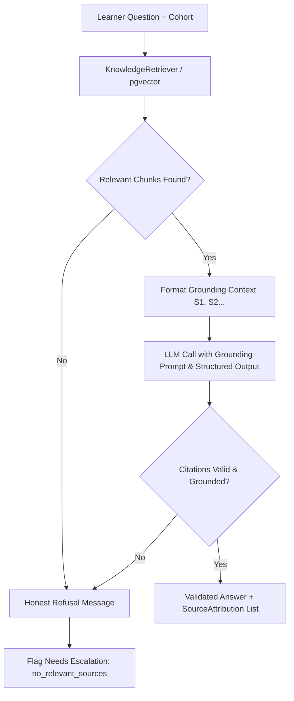
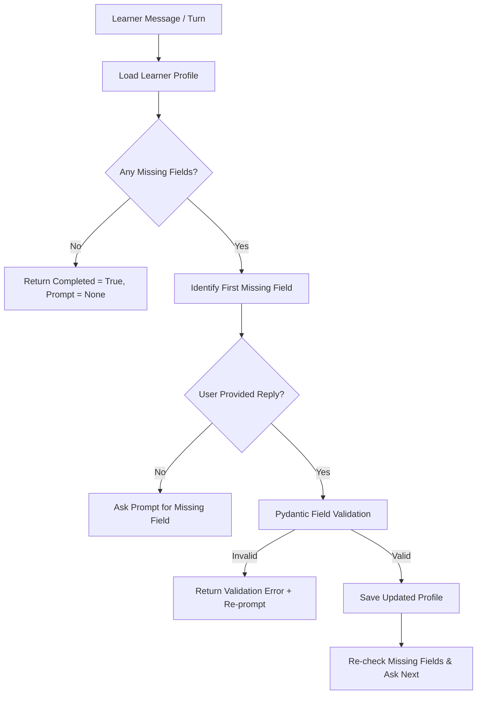

# Module 2 (Grounded Q&A) and Module 7 (Profile Collection) Technical Guide

This guide provides a comprehensive technical breakdown of **Module 2 (Model 2: Grounded Q&A)** and **Module 7 (Model 7: In-Chat Profile Collection)** for the AI Operations Support Agent. It explains how both modules work, how to enable/configure them, exact code structure and file locations, and verification/testing instructions.

---

## 1. Executive Summary & Status

Both **Module 2** and **Module 7** are fully implemented, fail-closed, and covered by comprehensive test suites in the repository:

- **Module 2 (M02 / Model 2 - Grounded Q&A)**: Guarantees that learner support responses are generated *only* from approved, cohort-scoped Operations materials with strict source attribution (`S1`, `S2`, ...). If no grounded evidence exists, it performs an **honest refusal** (`HONEST_REFUSAL_MESSAGE`) and signals escalation to Ops instead of hallucinating.
- **Module 7 (M07 / Model 7 - In-Chat Profile Collection)**: A deterministic, non-LLM missing field collector that gathers missing learner profile details (`preferred_name`, `timezone`, `cohort`) one field at a time in-chat. It validates answers using Pydantic (including IANA timezone checks) before persisting updates to ensure data integrity and prevent PII injection.

---

## 2. Module 2 (Model 2): Grounded Q&A Deep Dive

### 2.1 Architecture & Flow



### 2.2 How It Works

1. **Cohort-Scoped Retrieval**: Queries `pgvector` for approved source material matching the learner's cohort (`app/retrieval/retriever.py`).
2. **Context Alias Mapping**: Formats retrieved chunks into temporary safe aliases (`S1`, `S2`, ...) to prevent prompt injection or reliance on raw document filenames ([app/prompts/grounding.py](file:///d:/LLM/sprint/ops-chatbot-1-round-2/app/prompts/grounding.py#L20)).
3. **Structured LLM Invocation**: Sends the question and formatted context to the LLM via `GroundedAnswer` Pydantic schema enforcing `answer` string and `citations` list.
4. **Citation Validation & Attribution**: Checks that every alias cited in the answer actually exists in the retrieved context. If valid, attaches structured `SourceAttribution` metadata containing `title`, `source`, `similarity`, and `cohort`.
5. **Fail-Closed Guardrails**: If any step fails (missing question, unknown cohort, no chunks, LLM error, invalid JSON, or hallucinated citation alias), the system instantly returns the standard honest refusal message:
   > *"I don't have enough information in my approved materials to answer your question accurately. I've flagged this for our Operations team to assist you."*

### 2.3 Key Code Details

- **Entry Point API**: [app/qa/graph.py](file:///d:/LLM/sprint/ops-chatbot-1-round-2/app/qa/graph.py)
  - `answer_question(question: str, *, cohort: str) -> QAResult`
  - `build_qa_graph()`: Compiles dedicated LangGraph workflow node `grounded_answer`.
- **Node Core Logic**: [app/graph/nodes/answer.py](file:///d:/LLM/sprint/ops-chatbot-1-round-2/app/graph/nodes/answer.py)
  - `grounded_answer(state: GraphState, config: RunnableConfig | None = None)`
  - Data Models: `AnswerOutcome`, `SourceAttribution`, `EscalationReason`
- **Prompts & Schemas**: [app/prompts/grounding.py](file:///d:/LLM/sprint/ops-chatbot-1-round-2/app/prompts/grounding.py)
  - `HONEST_REFUSAL_MESSAGE`: Standard fallback string.
  - `GroundedAnswer`: Pydantic model for structured output validation.
- **Streaming Support**: [app/qa/stream.py](file:///d:/LLM/sprint/ops-chatbot-1-round-2/app/qa/stream.py)
  - `stream_answer(question: str, *, cohort: str)`: Yields validated grounded answer lines or honest refusal.

### 2.4 How to Enable and Turn On Module 2

1. **Configure Environment Variables**:
   Ensure `.env` contains valid LLM provider credentials and database connection details:
   ```ini
   LLM_PROVIDER=openai
   OPENAI_API_KEY=sk-...
   POSTGRES_SERVER=localhost
   POSTGRES_PORT=5432
   POSTGRES_DB=ops_chatbot
   POSTGRES_USER=postgres
   POSTGRES_PASSWORD=postgres
   ```

2. **Run FastAPI Application**:
   ```powershell
   # Start local dev server
   uvicorn app.main:app --reload --port 8000
   ```

3. **Trigger via HTTP API**:
   Submit a query to the chatbot API endpoint:
   ```bash
   POST /api/v1/chatbot/chat
   Content-Type: application/json

   {
     "message": "What is the deadline for project 1?",
     "cohort": "summer-2026"
   }
   ```

4. **Programmatic Python Invocation**:
   ```python
   import asyncio
   from app.qa.graph import answer_question

   async def main():
       result = await answer_question("When is the orientation session?", cohort="summer-2026")
       print("Answer:", result.answer)
       print("Grounded:", result.grounded)
       print("Sources:", [s.model_dump() for s in result.sources])

   asyncio.run(main())
   ```

---

## 3. Module 7 (Model 7): In-Chat Profile Collection Deep Dive

### 3.1 Architecture & Flow



### 3.2 How It Works

1. **Deterministic Field Sequence**: Profile fields are collected in a fixed, predictable order defined by `ProfileField`:
   1. `PREFERRED_NAME` (`preferred_name`)
   2. `TIMEZONE` (`timezone`)
   3. `COHORT` (`cohort`)
2. **Non-LLM Validation**: To protect privacy and prevent hallucinated personal data, the collector validates user input using Pydantic rather than an LLM prompt.
3. **Strict Validation Rules**:
   - `preferred_name` & `cohort`: Strip whitespace; reject blank strings.
   - `timezone`: Uses Python `zoneinfo.ZoneInfo` to verify that the string is a valid IANA timezone (e.g. `Africa/Cairo`, `America/New_York`).
4. **State Persistence & Re-asking Prevention**: Validated fields are saved immediately to the profile repository. Completed fields are never re-asked.

### 3.3 Key Code Details

- **Collector Engine**: [app/profile/collector.py](file:///d:/LLM/sprint/ops-chatbot-1-round-2/app/profile/collector.py)
  - `ProfileCollector`: Core class handling `start(user_id)` and `accept_reply(user_id, reply)`.
  - `CollectionTurn`: Dataclass returning `(profile, prompt, completed, validation_error)`.
  - `inchat_collection_flow(user_id, reply=None, repository=None)`: Seam for graph and workflow integration.
  - `InMemoryProfileRepository`: Lightweight store for development and testing.
- **Profile Schema & Validators**: [app/profile/schema.py](file:///d:/LLM/sprint/ops-chatbot-1-round-2/app/profile/schema.py)
  - `ProfileField` Enum: Enforces field order.
  - `LearnerProfile`: Pydantic model with custom `@field_validator` functions for text cleaning and IANA timezone checks.

### 3.4 How to Enable and Turn On Module 7

1. **Programmatic Usage**:
   ```python
   import asyncio
   from app.profile.collector import InMemoryProfileRepository, ProfileCollector

   async def demo_collection():
       repo = InMemoryProfileRepository()
       collector = ProfileCollector.with_repository(repo)

       # Step 1: Start collection (asks for preferred name)
       turn1 = await collector.start(user_id="learner-101")
       print("Prompt:", turn1.prompt) # "Before we continue, what name would you like us to use?"

       # Step 2: Submit preferred name (valid -> asks for timezone)
       turn2 = await collector.accept_reply(user_id="learner-101", reply="Ahmed Magdi")
       print("Prompt:", turn2.prompt) # "What is your timezone? Please use an IANA value such as Africa/Cairo."

       # Step 3: Submit invalid timezone (invalid -> returns error and re-prompts)
       turn3 = await collector.accept_reply(user_id="learner-101", reply="Cairo time")
       print("Error:", turn3.validation_error) # "must be an IANA timezone such as Africa/Cairo"

       # Step 4: Submit valid timezone (valid -> asks for cohort)
       turn4 = await collector.accept_reply(user_id="learner-101", reply="Africa/Cairo")
       print("Prompt:", turn4.prompt)

       # Step 5: Submit cohort (valid -> completed = True)
       turn5 = await collector.accept_reply(user_id="learner-101", reply="Summer 2026")
       print("Completed:", turn5.completed) # True

   asyncio.run(demo_collection())
   ```

2. **Integration into Main Chatbot Graph**:
   Incorporate `inchat_collection_flow` as a conditional graph node prior to routing Q&A requests when a learner has incomplete profile data.

---

## 4. Test Suite & Verification

The functionality of both Module 2 and Module 7 is verified by automated test suites.

### 4.1 Test Files
- **Module 2 (M02) Tests**:
  - [tests/test_grounding.py](file:///d:/LLM/sprint/ops-chatbot-1-round-2/tests/test_grounding.py): 425 lines testing chunk citations, context alias mapping, fail-closed honest refusal, and attribution.
  - [tests/test_qa_week3.py](file:///d:/LLM/sprint/ops-chatbot-1-round-2/tests/test_qa_week3.py): Tests graph entry point compilation, response streaming, and eval metrics.
- **Module 7 (M07) Tests**:
  - [tests/test_profile.py](file:///d:/LLM/sprint/ops-chatbot-1-round-2/tests/test_profile.py): Tests sequential field prompts, Pydantic validation error handling, IANA timezone checks, and state completion.

### 4.2 Running Tests Locally

Run targeted tests using pytest or `uv`:

```powershell
# Using uv (recommended)
uv run pytest tests/test_grounding.py tests/test_profile.py tests/test_qa_week3.py

# Or standard pytest
pytest tests/test_grounding.py tests/test_profile.py tests/test_qa_week3.py
```
