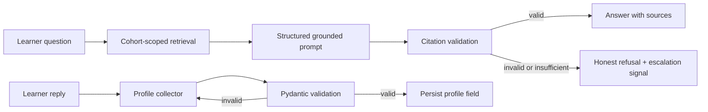

# Week 3 team documentation

## Scope

This delivery addresses the Week 3 review request: retrieval-grounded Q&A and in-chat profile collection. It is separate from the earlier escalation/ticketing work in PR #18.

## Architecture

## Operational contract

- Q&A entry point: `app.qa.graph.answer_question(question, cohort=...)`.
- Every successful Q&A result has `grounded=True`, at least one source, and no escalation signal.
- Every unsupported or invalid result has `grounded=False` and `needs_escalation=True`.
- `app.qa.stream.stream_answer` streams only the already-validated result.
- `ProfileCollector` collects `preferred_name`, `timezone`, and `cohort` in order. The repository interface makes production persistence replaceable without changing collection rules.

## Team maintenance checklist

1. Add or update approved materials through the knowledge-base ingestion path; do not hard-code answers.
2. Add a grounding regression in `tests/test_grounding.py` whenever a new failure mode is found.
3. Keep prompt/schema changes synchronized: a prompt promise must be enforced in code.
4. Treat profile fields as a privacy contract. Add a field only with an operational owner, validation rule, and retention decision.
5. Run the focused Week 3 suite before review and the full suite before merging.

## Rollback

The Q&A and collector modules are isolated entry points. If a rollout issue occurs, route chat back to the existing assistant path and leave profile collection disabled; no model migration is required for this code-only rollback.
